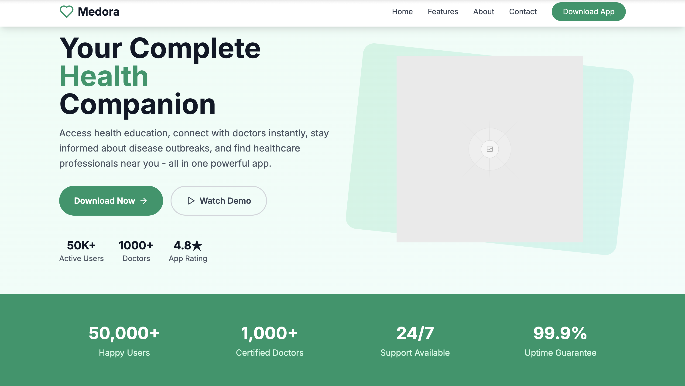

<div align="center">
  <h2 align="center">Medora</h2>

Medora is a fully responsive and healthcare landing page, Responsive for all devices. <br/> Built using Next.js and TailwindCSS.

<a href="https://medora-v1.web.app/"><strong>➥ Live Demo</strong></a>

</div>

<br />

### Demo Screeshots



### Prerequisites

Before you begin, ensure you have met the following requirements:

- [Git](https://git-scm.com/downloads "Download Git") must be installed on your operating system.

### Installing Medora

To install **Medora**, run this command on your git bash:

Linux and macOS:

```bash
sudo git clone https://github.com/rolandaayo/medora-landing-page.git
```

Windows:

```bash
git clone https://github.com/rolandaayo/medora-landing-page.git
```

## 💬 Contact

If you have an offer, opportunity, or introduction that might make my life more interesting, email me at ibiwoyeroland@gmail.com.

For the reasons stated above, I'll only respond to proposals that are matched for my schedule and interests.

### License

This project is **free to use** and does not contains any license.
